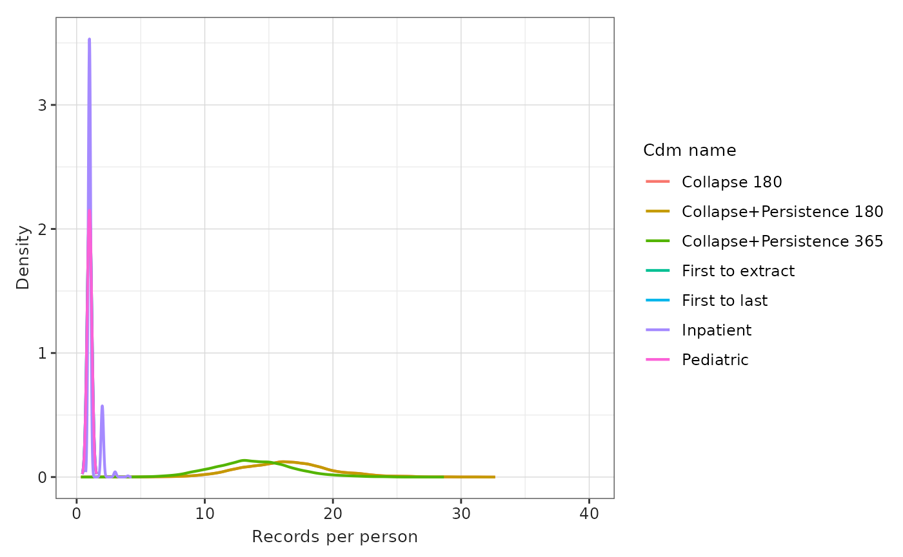
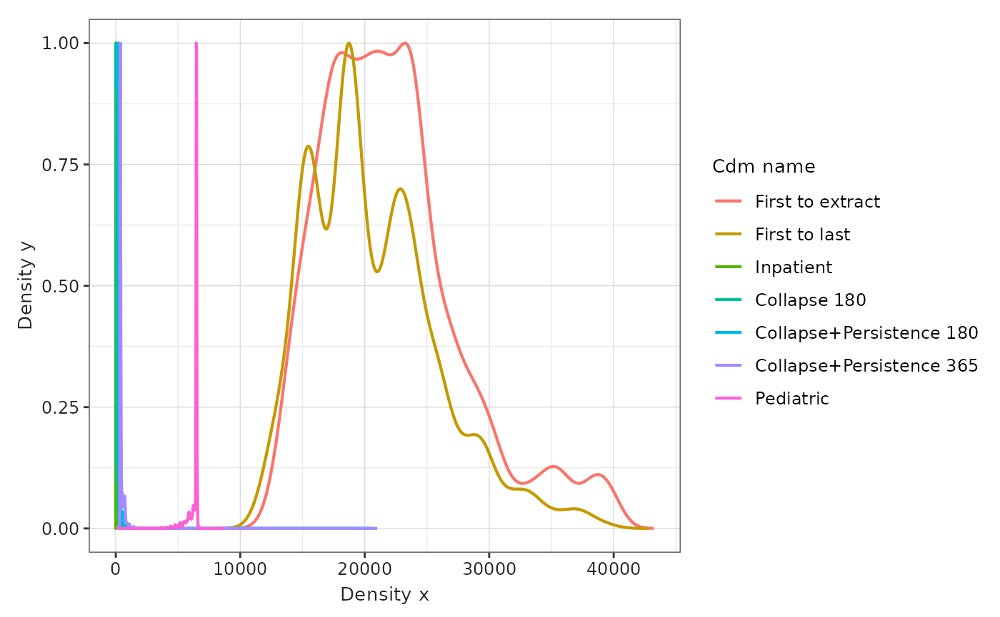
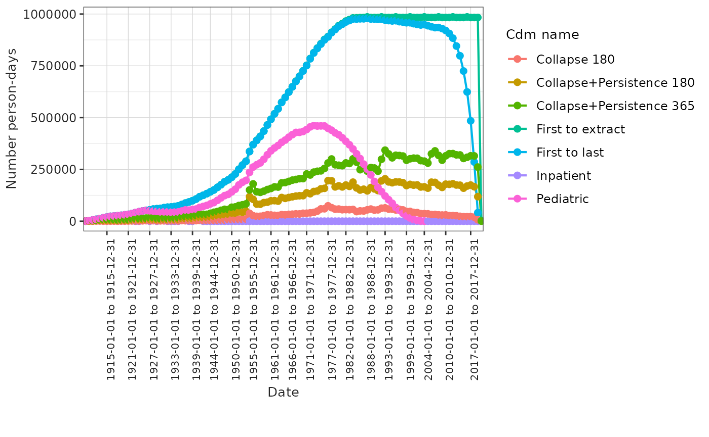
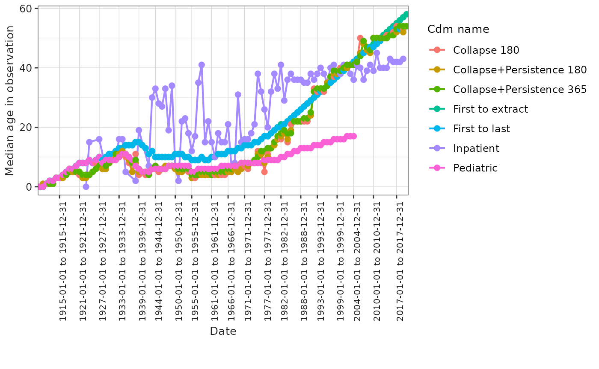

# Generating the Observation Period Table

## Introduction

The
[`observation_period`](https://ohdsi.github.io/CommonDataModel/cdm54.html#observation_period)
table is a central component of the [OMOP
CDM](https://ohdsi.github.io/CommonDataModel/).

*The observation_period table contains records which define spans of
time during which two conditions are expected to hold: (i) Clinical
Events that happened to the Person are recorded in the Event tables, and
(ii) absence of records indicate such Events did not occur during this
span of time.*

In practice, we summarise these two conditions by saying that a person
is in observation.

Accurately defining observation period is essential for many types of
studies. For example: in incidence or prevalence studies, it determines
the denominator population; in survival analyses, individuals are
censored once they are no longer in observation… The definition of
observation period can therefore strongly influence study results
\[CITE\].

For primary care or claims data, defining observation is relatively
straightforward, as it can be based on enrollment and disenrollment
dates. However, for datasets that only include secondary or tertiary
care records, it is more complex. In these cases, the
[HERON-UK](https://heron-uk.github.io/heron-uk/) network recommends
assigning a single observation period per person, starting from their
first record in the database (e.g., first hospital visit) and ending at
the earliest of: (1) the patient’s death date; (2) a censoring age
(commonly 120 years, but this may vary depending on the data source); or
(3) a censoring date (typically the data extraction date).[¹](#fn1)

In this vignette, we will illustrate several approaches to defining the
observation period:

1.  *First to extraction*: one observation period per person from first
    record to extraction date.
2.  *First to last*: one observation period per person from first record
    to last record in the database.
3.  *Inpatient*: individuals are in observation while they have an
    ongoing visit.
4.  *Collapse 180*: individuals are in observation while they have an
    ongoing record, different records are collapsed using a window of
    180 days.
5.  *Collapse+Persistence 180*: individuals are in observation while
    they have an ongoing record, different records are collapsed using a
    window of 180 days, a persistence window of 179 days is added at the
    end of each observation period.
6.  *Collapse+Persistence 365*: individuals are in observation while
    they have an ongoing record, different records are collapsed using a
    window of 365 days, a persistence window of 364 days is added at the
    end of each observation period.
7.  *Pediatric*: one observation period per person from first record to
    extraction date or 18th birthday of the individual.

To demonstrate these definitions, we will use a toy example containing 3
visit records (`visit_occurrence`) and 5 drug records (`drug_exposure`).
These are shown in Figure @ref(fig:fig-toy), where visits are shown in
blue and drug exposures in green.


Representation of a synthetic patient records.

Now we can built our 7 definitions of the observation period as seen in
Figure @ref(fig:fig-obs). The inpatient definition is the most
restrictive one and 3 observation periods are created one per each
inpatient episode, on the other hand the ‘First to extraction’ (1) and
‘Collapse+Persistence 365’ (6) are the one generating a longer period of
observed time. Note also that all individuals observation period are
censored at extraction date at the latest.


Different observation periods.

In the next section we will see how to built those observation periods
in a synthetic database.

## Build observation_period table in GiBleed

Now that we have seen the importance of the observation period
definition we will see how to built it in a synthetic dataset. For the
purpose of this example we will use the (**GiBleed**) dataset available
using [omock](https://ohdsi.github.io/omock/).

``` r
library(omock)
library(OmopConstructor)
library(OmopSketch)
library(dplyr, warn.conflicts = FALSE)
library(ggplot2)
library(visOmopResults)

cdm <- mockCdmFromDataset(datasetName = "GiBleed", source = "duckdb")
#> ℹ Loading bundled GiBleed tables from package data.
#> ℹ Adding drug_strength table.
#> ℹ Creating local <cdm_reference> object.
#> ℹ Inserting <cdm_reference> into duckdb.
cdm
#> 
#> ── # OMOP CDM reference (duckdb) of GiBleed ────────────────────────────────────
#> • omop tables: care_site, cdm_source, concept, concept_ancestor, concept_class,
#> concept_relationship, concept_synonym, condition_era, condition_occurrence,
#> cost, death, device_exposure, domain, dose_era, drug_era, drug_exposure,
#> drug_strength, fact_relationship, location, measurement, metadata, note,
#> note_nlp, observation, observation_period, payer_plan_period, person,
#> procedure_occurrence, provider, relationship, source_to_concept_map, specimen,
#> visit_detail, visit_occurrence, vocabulary
#> • cohort tables: -
#> • achilles tables: -
#> • other tables: -
```

This dataset has the `observation_period` table already populated, but
we will create it again using the 7 definitions that we have seen in the
section above. Note the `cdm` is inserted in a
[duckdb](https://r.duckdb.org) connection so we simulate for a real case
where we have the data in a database.

The `observation_period` table will be built using the
[`buildObservationPeriod()`](https://ohdsi.github.io/OmopConstructor/reference/buildObservationPeriod.html)
function and we will parametrise it in different ways for each case.
Later we will summarise it using
[OmopSketch](https://ohdsi.github.io/OmopSketch/) so we can compare the
different definitions at the end.

For all the definitions of observation period we will use
`censorAge = 120` and
`dateRange = as.Date(c("1900-01-01", "2020-01-01"))`. Note also that if
a death record is in the database the person will automatically be
censored that day. Unless otherwise specified by adjusting the
`recordsFrom` argument, records contributing to the observation period
are searched for in the following tables: `drug_exposure` and
`visit_occurrence`.

### First to extraction

To build observation period that span from the first record to the data
extraction we will need to set the `collapseDays` and `persistenceDays`
to `Inf` as we want to span the observation period till the extraction
of data.

``` r
cdm <- buildObservationPeriod(
  cdm = cdm,
  collapseDays = Inf,
  persistenceDays = Inf,
  censorAge = 120,
  dateRange = as.Date(c("1900-01-01", "2020-01-01"))
)

# summarise the generated observation_period using OmopSketch
result1a <- summariseObservationPeriod(observationPeriod = cdm$observation_period,
                                       byOrdinal = FALSE)
#> Warning: The `observationPeriod` argument of `summariseObservationPeriod()` is
#> deprecated as of OmopSketch 0.5.1.
#> ℹ Please use the `cdm` argument instead.
#> This warning is displayed once per session.
#> Call `lifecycle::last_lifecycle_warnings()` to see where this warning was
#> generated.
#> ℹ retrieving cdm object from cdm_table.
result1b <- summariseInObservation(observationPeriod = cdm$observation_period,
                                   interval = "years",
                                   output = c("person-days", "age"))
#> Warning: `summariseInObservation()` was deprecated in OmopSketch 1.0.0.
#> ℹ Please use `summariseTrend()` instead.
#> This warning is displayed once per session.
#> Call `lifecycle::last_lifecycle_warnings()` to see where this warning was
#> generated.

# change cdm_name to identify the different results objects
result1 <- bind(result1a, result1b) |>
  mutate(cdm_name = "First to extract")
```

### First to last

To built observation period that span from the first record to the last
record extraction we will need to set the `collapseDays` to `Inf` and
`persistenceDays` to `0` as we do not want to add any time after the
last record. This observation period definition can be problematic as
observation periods change retrospectively in each data extraction and
toward the end of observation you end up with a more sick population
being in observation.

``` r
cdm <- buildObservationPeriod(
  cdm = cdm,
  collapseDays = Inf,
  persistenceDays = 0,
  censorAge = 120,
  dateRange = as.Date(c("1900-01-01", "2020-01-01"))
)

# summarise the generated observation_period using OmopSketch
result2a <- summariseObservationPeriod(observationPeriod = cdm$observation_period,
                                       byOrdinal = FALSE)
#> ℹ retrieving cdm object from cdm_table.
result2b <- summariseInObservation(observationPeriod = cdm$observation_period,
                                   interval = "years",
                                   output = c("person-days", "age"))

# change cdm_name to identify the different results objects
result2 <- bind(result2a, result2b) |>
  mutate(cdm_name = "First to last")
```

### Inpatient

To built observation period for the inpatient episodes we will set the
`collapseDays` and `persistenceDays` to `0` as we do not want to
collapse or add any time after the records. We will also have to specify
that we only want to use data in the `visit_occurrence` table, we will
do that using the `recordsFrom` argument
(`recordsFrom = visit_occurrence`). This would result in most people
having multiple observation periods, with each period duration being
relatively short. This is not a good option to use if you want to
calculate incidence or prevalence, as it will result in an unreliable
denominator.

``` r
cdm <- buildObservationPeriod(
  cdm = cdm,
  collapseDays = 0,
  persistenceDays = 0,
  censorAge = 120,
  dateRange = as.Date(c("1900-01-01", "2020-01-01")),
  recordsFrom = "visit_occurrence"
)
#> ℹ `persistenceDays` (0) can not be equal to `collapseDays` (0) as back to back
#>   observation periods are not allowed, setting `collapseDays = 1`.

# summarise the generated observation_period using OmopSketch
result3a <- summariseObservationPeriod(observationPeriod = cdm$observation_period,
                                       byOrdinal = FALSE)
#> ℹ retrieving cdm object from cdm_table.
result3b <- summariseInObservation(observationPeriod = cdm$observation_period,
                                   interval = "years",
                                   output = c("person-days", "age"))

# change cdm_name to identify the different results objects
result3 <- bind(result3a, result3b) |>
  mutate(cdm_name = "Inpatient")
```

### Collapse 180

To collapse records separated by 180 days we will use the `collapseDays`
argument (`collapseDays = 180`) and set `persistenceDays` to `0` as we
add any time after the records.

``` r
cdm <- buildObservationPeriod(
  cdm = cdm,
  collapseDays = 180,
  persistenceDays = 0,
  censorAge = 120,
  dateRange = as.Date(c("1900-01-01", "2020-01-01"))
)

# summarise the generated observation_period using OmopSketch
result4a <- summariseObservationPeriod(observationPeriod = cdm$observation_period,
                                       byOrdinal = FALSE)
#> ℹ retrieving cdm object from cdm_table.
result4b <- summariseInObservation(observationPeriod = cdm$observation_period,
                                   interval = "years",
                                   output = c("person-days", "age"))

# change cdm_name to identify the different results objects
result4 <- bind(result4a, result4b) |>
  mutate(cdm_name = "Collapse 180")
```

### Collapse+Persistence 180

To collapse records separated by 180 days we will use the `collapseDays`
argument (`collapseDays = 180`), this time we will set `persistenceDays`
to `179` as we want to add 179 days after any record. Note
`persistenceDays` and `collapseDays` can not be the same because *back
to back* observation periods are not allowed.

``` r
cdm <- buildObservationPeriod(
  cdm = cdm,
  collapseDays = 180,
  persistenceDays = 179,
  censorAge = 120,
  dateRange = as.Date(c("1900-01-01", "2020-01-01"))
)

# summarise the generated observation_period using OmopSketch
result5a <- summariseObservationPeriod(observationPeriod = cdm$observation_period,
                                       byOrdinal = FALSE)
#> ℹ retrieving cdm object from cdm_table.
result5b <- summariseInObservation(observationPeriod = cdm$observation_period,
                                   interval = "years",
                                   output = c("person-days", "age"))

# change cdm_name to identify the different results objects
result5 <- bind(result5a, result5b) |>
  mutate(cdm_name = "Collapse+Persistence 180")
```

### Collapse+Persistence 365

In this case we will set arguments to `365` and `364` analogously to the
previous definition.

``` r
cdm <- buildObservationPeriod(
  cdm = cdm,
  collapseDays = 365,
  persistenceDays = 364,
  censorAge = 120,
  dateRange = as.Date(c("1900-01-01", "2020-01-01"))
)

# summarise the generated observation_period using OmopSketch
result6a <- summariseObservationPeriod(observationPeriod = cdm$observation_period,
                                       byOrdinal = FALSE)
#> ℹ retrieving cdm object from cdm_table.
result6b <- summariseInObservation(observationPeriod = cdm$observation_period,
                                   interval = "years",
                                   output = c("person-days", "age"))

# change cdm_name to identify the different results objects
result6 <- bind(result6a, result6b) |>
  mutate(cdm_name = "Collapse+Persistence 365")
```

### Pediatric

In this case we will use the same definition that we used for (First to
extraction) but we will set up the `censorAge` argument to 18 as we want
to simulate a database with pediatric data where we loose followup after
the patient turns 18 as they are moved to other specialised cares.

``` r
cdm <- buildObservationPeriod(
  cdm = cdm,
  collapseDays = Inf,
  persistenceDays = Inf,
  censorAge = 18,
  dateRange = as.Date(c("1900-01-01", "2020-01-01"))
)

# summarise the generated observation_period using OmopSketch
result7a <- summariseObservationPeriod(observationPeriod = cdm$observation_period,
                                       byOrdinal = FALSE)
#> ℹ retrieving cdm object from cdm_table.
result7b <- summariseInObservation(observationPeriod = cdm$observation_period,
                                   interval = "years",
                                   output = c("person-days", "age"))

# change cdm_name to identify the different results objects
result7 <- bind(result7a, result7b) |>
  mutate(cdm_name = "Pediatric")
```

## Comparison of the different definitions

We can easily merge the different results into a single result object
using the
[`bind()`](https://darwin-eu.github.io/omopgenerics/reference/bind.summarised_result.html)
function.

``` r
result <- bind(result1, result2, result3, result4, result5, result6, result7)
```

If we compare the overall statistics of the observation period:

``` r
tableObservationPeriod(result)
```

[TABLE]

Summary of observation_period table

We can see that definitions (1), (2) and (7) lead to a one observation
period per person by definition. The Collapse 180 (4) and
Collapse+Persistence180 (5) lead to the same number of observation
periods but with different durations. We can take a better look to this
statistics looking at the plots:

``` r
plotObservationPeriod(result = result, 
                      variableName = "Records per person",
                      plotType = "densityplot", 
                      colour = "cdm_name") +
  ggplot2::coord_cartesian(xlim = c(NA, 40))
#> ! Multiple values of `variable_level` detected, consider including them in
#>   either: `x`, `facet`, `colour`, and `group`.
```



As expected for example we can see that using a window of 180 creates
more observation periods that using the 365 collapse window, this is
expected, the bigger the window the less observation periods we will
have.

Now taking a look at the length of the observation periods, to make the
plot more clear we will renomalise to a maximum of 1 so we can see the
different densities side by side:

``` r
result |>
  filterSettings(result_type == "summarise_observation_period") |>
  filter(
    variable_name == "Duration in days",
    estimate_name %in% c("density_x", "density_y")
  ) |>
  tidy() |>
  mutate(cdm_name = factor(cdm_name, levels = unique(cdm_name))) |>
  group_by(cdm_name) |>
  mutate(density_y = density_y / max(density_y)) |>
  ungroup() |>
  scatterPlot(
    x = "density_x",
    y = "density_y",
    line = TRUE,
    point = FALSE,
    ribbon = FALSE,
    colour = "cdm_name"
  )
```



As we can see the Collapse, persistent and Inpatient approaches generate
short observation periods, in the pediatric approach most of the
individuals are censored at their 18th birth day and as in **GiBleed**
we have many individuals contributing since their birth date we have a
peak at ~6574 days. ‘First to extract’ and ‘First to last’ show similar
time distributions with higher times for the ‘First to extract’
approach.

Now we can compare the amount of person-days in observation for each one
of the observation period definitions, note this would be the
denominator of an incidence or prevalence study.

``` r
result |>
  filter(variable_name == 'Number person-days') |>
  plotInObservation(colour = "cdm_name")
#> Warning: `plotInObservation()` was deprecated in OmopSketch 1.0.0.
#> ℹ Please use `plotTrend()` instead.
#> This warning is displayed once per session.
#> Call `lifecycle::last_lifecycle_warnings()` to see where this warning was
#> generated.
#> Warning: `result` does not contain any `summarise_trend` data.
```



In this plot there are some trends worth remarking:

- A larger gap increases the observation time (green vs yellow)

- Adding a persistence window increases quite a bit the observable time
  (red vs green)

- Using the first to last approach lead to less individuals being in
  observation towards the end of the observation window.

Finally, to show more in depth the findings we can see the evolution of
the median age of the individuals in observation:

``` r
result |>
  filter(variable_name == 'Median age in observation') |>
  plotInObservation(colour = "cdm_name")
#> Warning: `result` does not contain any `summarise_trend` data.
```



In this case we see that the pediatric population always has a lower
median age as individuals are censored when they turn 18. Due to
**GiBleed** nature we do not see other trends that we see in real world
data like older population in observation the lower the collapse window
is, sicker and older population for the inpatient definition, or sicker
population at the closer you get to the extraction date for the ‘First
to last’ definition.

TODO: Add citation to the observation period methods paper when ready.
TODO: Invite collaborators to submit their results and have a shiny with
the comparison and impact of the decision in different datasets.

## Final remarks

As seen, the observation period table is key and has a significant
impact on many studies. Therefore, defining the observation period must
be done carefully, with full awareness of the limitations associated
with each approach. The most appropriate observation period often varies
from study to study. This is where **OmopConstructor** becomes
especially valuable, as it allows users to define custom observation
periods on a study-by-study basis.

> **Note:** For database back-end cdms note the `observation_period`
> table is generated in the `writeSchema`. If you want to use it to
> generate the `observation_period` in the `cdmSchema` you will need to
> use the `writeSchema = cdmSchema` and have writing permissions in the
> `cdmSchema`.

------------------------------------------------------------------------

1.  <https://heron-uk.github.io/heron-uk/data_conventions/observation_period.html>
